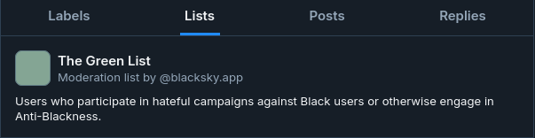

# Blacksky Moderation

Any content labeled by Bluesky's AI-based labeler is automatically filtered out of the feed as soon as it is labeled. This usually occurs at the time of posting, but can happen later.
[Defined by Bluesky](https://bsky.social/about/blog/03-12-2024-stackable-moderation), labels are annotations on users and content. They can be used to hide, warn, and categorize [posts, and users on] the network

The Blacksky Moderation Service, @blacksky.app, is where you can report posts for antiblackness and misogynoir. The service is also a labeler that you can subscribe to in order to be warned about harmful or insensitive content. Also see, [How Do I Subscribe to the Blacksky Moderation Service Labeler](/docs/blacksky-info/how-to-add#labeler)

Other content that doesn't belong in the feed can be reported to [@blacksky.app](https://bsky.app/profile/blacksky.app), where a team of moderators will review the content for removal from the feed.

Antiblack content or misogynoir that appears elsewhere in any of the official Blacksky feeds should be reported to [@blacksky.app](https://bsky.app/profile/blacksky.app) in order to protect Blacksky from malicious content from any source.

Blacksky also filters out sexually explicit images based on labels from the official Bluesky Moderation Service [@moderation.bsky.app](https://bsky.app/profile/moderation.bsky.app), and the main Blacksky and Blacksky Trending feeds.

We might label the content, add the user to the Green List, and/or prevent the user from viewing the Blacksky feed.

*Here's what the moderation list "Green List" looks like*

We recommend that you do not publicly “flag” posts (e.g., repost or engage via a reply), as harassers will use that to target you in the future or start conflict within the community. Using @blacksky.app to report harassers ensures your confidentiality and protects your peace on Blacksky and Bluesky.

See something or someone in the Blacksky feeds that doesn’t belong?\
\
Report that to @blacksky.app.
See someone harassing Black folks anywhere on Bluesky?\
\
Report that to @blacksky.app.\
\
See something that could otherwise harm Black folks (e.g. screenshots of racist posts on X)? Report to @blacksky.app

Also, see [How to Do I Report a Post to the Blacksky Moderation Service](/docs#how-do-i-report-a-post-to-the-blacksky-moderation-service) (blacksky.app)?

The moderation service gives you a discrete way to report harmful content but it also allows Blacksky to enable features that protect the community. For example, the Blacksky “Banned from TV” feature allows for certain accounts that are reported to be blocked from even seeing the feed.

Any accounts blocked by “Banned From TV” will see the following when trying to load any of the Blacksky feeds:

