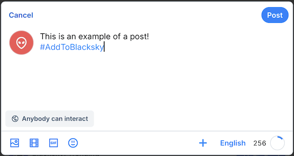
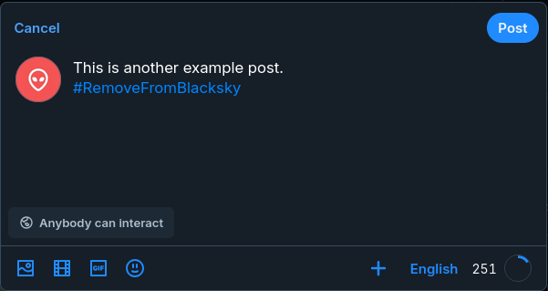
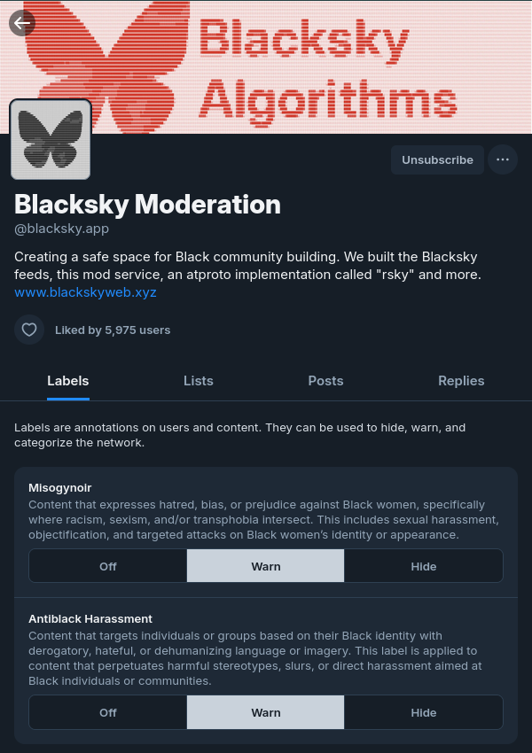

# Joining Blacksky Feeds and Moderation Tools
This section outlines how to join feeds and moderation tools. Although this section uses Blacksky feeds and moderation examples, this applies to any other available feed or moderation tool.
## Feeds
There are several feeds created by Blacksky Algorithms:
1. *[Blacksky](https://bsky.app/profile/rudyfraser.com/feed/blacksky)*
2. *[Blacksky: Trending](https://bsky.app/profile/rudyfraser.com/feed/blacksky-trend)*
3. *[Blackademics](https://bsky.app/profile/rudyfraser.com/feed/blacksky-edu)*

> Note: You may see that the feeds are authored by "@rudyfraser.com". Those are the right feeds.

### joining-a-blacksky-feed
Create a post and include the #AddToBlacksky hashtag (This only needs to be done once). All posts after will be included in the Blacksky feed.

### leaving-a-blacksky-feed
Create a post and include the #RemoveFromBlacksky hashtag. All posts after will NOT be included in any of the Blacksky feeds.

### Pinning a Feed
1. Open the [Bluesky](https://bsky.app) app.
2. Navigate to the search page.
3. Type in the title of any of the feeds previously mentioned.
4. Click on the "+" to join this feed.

## Moderation Tools

### Labeler
1. Go to the [Blacksky profile](https://bsky.app/profile/blacksky.app) on Bluesky.
2. Click Subscribe to Labeler.
3. After subscribing, all posts on Bluesky will be labeled with a warning (Warn setting) by default:
- **Misogynoir**: Content that expresses hatred, bias, or prejudice against Black women, specifically where racism, sexism, and/or transphobia intersect. This includes sexual harassment, objectification, and targeted attacks on Black women’s identity or appearance.
- **Antiblack Harassment**: Content that targets individuals or groups based on their Black identity with derogatory, hateful, or dehumanizing language or imagery. This label is applied to content that perpetuates harmful stereotypes, slurs, or direct harassment aimed at Black individuals or communities.

You can turn this Off or change the Warn to Hide. Selecting Hide will hide any posts with the label from your feeds.
