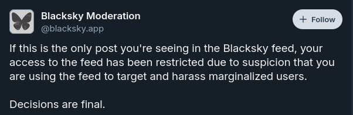

# Frequently Asked Questions

### What is the AT Protocol?
The Authenticated Transfer Protocol (aka atproto) is the decentralized social networking protocol that is used to build open social media applications, like Bluesky.

Here's a [link to a Bluesky blog](https://bsky.social/about/blog/02-22-2024-open-social-web) post that explains what it is, and why it differs from other social apps you may be used to.

### How do I Add Myself to the Blacksky Feed?
See [Joining a Blacksky Feed](/docs/blacksky-info/how-to-add.md#Joining-a-Blacksky-Feed).

### How do I Remove Myself from the Blacksky Feed or Starter Pack?
See [Leaving a Blacksky Feed](/docs/blacksky-info/how-to-add.md#Leaving-a-Blacksky-Feed).

### How do I Report a Post to the Blacksky Moderation Service?
To report a post:
1. Click the … icon on the bottom-right of the post.
2. Select **Report Post**.
3. Select an option under "Why should this post be reviewed?" Note that at the time of writing, the only reasons that will allow you to select Blacksky as your moderator are "*Unwanted Sexual Content*", "*Anti-Social Behavior*", "*Illegal and Urgent*", and "*Other*".
4. On the "**Select Moderation Service**" step that appears, select BlackSky Moderation.
5. Click submit report. For "Other" please always submit a comment or details so we know why something is being reported.

> If you'd like to report to additional services like reporting to Bluesky's Moderation Service, repeat these steps and select the appropriate moderation service..

### How do I know if I got banned?
If this is the only post you're seeing in the Blacksky feed, then your access to the feed has been restricted due to suspicion that you are using the feed to target and harass marginalized users.

### Can I submit feedback for Blacksky?
Yes! We're constantly innovating and evolving based on user feedback from our community. To submit feedback about Blacksky, simply write an email to [rudy@blacksky.app](mailto:rudy%40blacksky.app?subject=Feedback%20For%20Blacksky)

> Please note, we are only taking feedback for improvements and features to the feed, moderation services, etc. Do not use this form to report malicious or harassment posts.

## Getting Involved with Blacksky
First, we appreciate you showing interest in contributing to the rsky project!

This project heavily involves the AT Protocol. There are resources attached to this section that you can use to gain a better understanding.

* [ATProto for Distributed Systems Engineers](https://atproto.com/articles/atproto-for-distsys-engineers)
* [AT Protocol Specifications](https://atproto.com/#resources)
* [Official Bluesky PDS (In TypeScript)](https://github.com/bluesky-social/atproto/tree/main/packages/pds)
* [Official Blacksky PDS (In Rust)](https://github.com/blacksky-algorithms/rsky/tree/main/rsky-pds)
* [Bigsky, the official Bluesky Relay](https://github.com/bluesky-social/indigo/tree/main/cmd/bigsky)
  * It can be accessed at https://relay1.us-east.bsky.network, but the popular option is to use https://bsky.network/.
* [Jetstream, a bandwidth-friendly relay](https://github.com/bluesky-social/jetstream)
* [Official Bluesky Appview](https://github.com/bluesky-social/atproto/tree/main/packages/bsky)
* [Example AppView](https://github.com/bluesky-social/statusphere-example-app/tree/main)
* [Constellation, a global backlink indexing tool](https://github.com/at-microcosm/links/tree/main/constellation)

At a high level, the Authenticated Transfer Protocol (aka AT Protocol, ATProto, atproto) is a generic, federated protocol for building open social media appliactions. Personal Data Servers (or PDSs) store user data and handle identity. Relays aggregate and distribute data across the network. App Views aggregate data from the relays, for it to be used in feeds.

We understand that not everyone is in a position to give technical contributions to the project. We want to outline some other ways you can contribute. Don't feel pressured if you aren't in a position to participate in upcoming suggestions. Simply giving us a "star", or sharing the word about the project is appreciated.

Some other ways you can contribute to the project include:
- [Financial Contributions](https://opencollective.com/blacksky)
- Updating and/or Translating Documentation
  - Writing Tutorials
  - Adapting the Project for Specific Regions
- Community Support
- Design Elements
  - User Experience
  - User Interface

If there are any other ways you would like to contribute to the project. Consider reaching out to [the team](mailto:rudy%40blacksky.app?subject=Other%20Ways%20to%20Contribute) to see if there is a fit!
